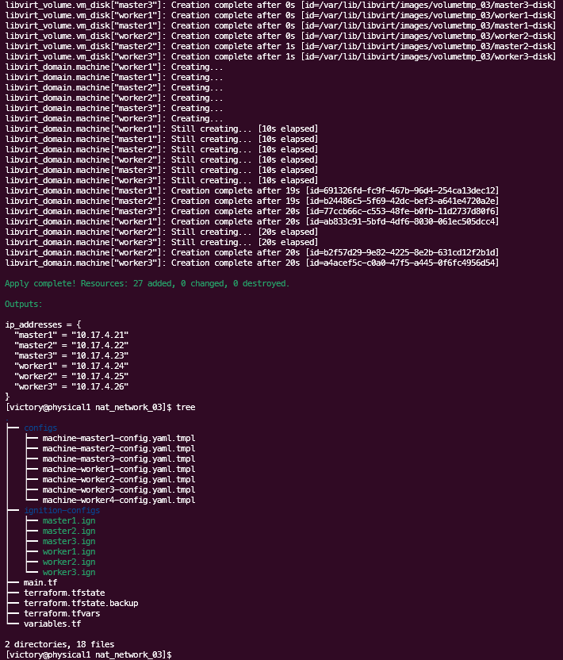

# Terraform OpenShift KVM Deployment

Este repositorio contiene tres subproyectos de Terraform que se deben ejecutar de manera independiente para evitar conflictos de nombres. Siga las instrucciones a continuación para inicializar y aplicar cada subproyecto.

## Estructura del Proyecto

- `br0_network/`
- `nat_network_02/`
- `nat_network_03/`

## Requisitos

- [Terraform](https://www.terraform.io/downloads.html) v0.13 o superior
- Acceso a un servidor KVM con libvirt

## Instrucciones de Ejecución


Clonar el Repositorio de Terraform

Clona el repositorio que contiene tu configuración de Terraform.

```bash
git clone https://github.com/vhgalvez/terraform-openshift-kvm-deployment.git
cd terraform-openshift-kvm-deployment_
```

### Inicializar y Aplicar Terraform para `br0_network`


1. Navegue al directorio `br0_network`:

   ```bash
   cd br0_network
   ```

2. Inicialice Terraform y actualice los proveedores:

   ```bash
   sudo terraform init --upgrade
   ```

3. Aplique la configuración de Terraform:

   ```bash
   sudo terraform apply
   ```

### Inicializar y Aplicar Terraform para `nat_network_02`

1. Navegue al directorio `nat_network_02`:

   ```bash
   cd ../nat_network_02
   ```

2. Inicialice Terraform y actualice los proveedores:

   ```bash
   sudo terraform init --upgrade
   ```

3. Aplique la configuración de Terraform:

   ```bash
   sudo terraform apply
   ```

### Inicializar y Aplicar Terraform para `nat_network_03`

1. Navegue al directorio `nat_network_03`:

   ```bash
   cd ../nat_network_03
   ```

2. Inicialice Terraform y actualice los proveedores:

   ```bash
   sudo terraform init --upgrade
   ```

3. Aplique la configuración de Terraform:

   ```bash
   sudo terraform apply
   ```


## Notas Adicionales

- Asegúrese de tener las variables y configuraciones adecuadas en los archivos `terraform.tfvars` de cada subproyecto.
- Cada subproyecto tiene su propio `main.tf` y configuración de variables, por lo que no debería haber conflictos de nombres si sigue las instrucciones anteriores.
- Puede ajustar las configuraciones y variables según sea necesario para adaptarse a su entorno y necesidades específicas.

## Detalles de las Máquinas Virtuales

### bastion_network

- **Nombre:** bastion1
- **CPU:** 2
- **Memoria:** 2048 MB
- **IP:** 192.168.0.35
- **Rol:** Acceso seguro, Punto de conexión de bridge
- **Sistema Operativo:** Rocky Linux 9.3 Minimal

### nat_network_02

- **Nombre:** freeipa1
  - **CPU:** 2
  - **Memoria:** 2048 MB
  - **IP:** 10.17.3.11
  - **Rol:** Servidor de DNS y gestión de identidades
  - **Sistema Operativo:** Rocky Linux 9.3

- **Nombre:** load_balancer1
  - **CPU:** 2
  - **Memoria:** 2048 MB
  - **IP:** 10.17.3.12
  - **Rol:** Balanceo de carga para el clúster
  - **Sistema Operativo:** Rocky Linux 9.3

- **Nombre:** postgresql1
  - **CPU:** 2
  - **Memoria:** 2048 MB
  - **IP:** 10.17.3.13
  - **Rol:** Gestión de bases de datos
  - **Sistema Operativo:** Rocky Linux 9.3

### nat_network_03

- **Nombre:** bootstrap1
  - **CPU:** 2
  - **Memoria:** 2048 MB
  - **IP:** 10.17.3.14
  - **Rol:** Inicialización del clúster
  - **Sistema Operativo:** Flatcar Container Linux

- **Nombre:** master1
  - **CPU:** 2
  - **Memoria:** 4096 MB
  - **IP:** 10.17.4.21
  - **Rol:** Gestión del clúster
  - **Sistema Operativo:** Flatcar Container Linux

- **Nombre:** master2
  - **CPU:** 2
  - **Memoria:** 4096 MB
  - **IP:** 10.17.4.22
  - **Rol:** Gestión del clúster
  - **Sistema Operativo:** Flatcar Container Linux

- **Nombre:** master3
  - **CPU:** 2
  - **Memoria:** 4096 MB
  - **IP:** 10.17.4.23
  - **Rol:** Gestión del clúster
  - **Sistema Operativo:** Flatcar Container Linux

- **Nombre:** worker1
  - **CPU:** 2
  - **Memoria:** 3584 MB
  - **IP:** 10.17.4.24
  - **Rol:** Ejecución de aplicaciones
  - **Sistema Operativo:** Flatcar Container Linux

- **Nombre:** worker2
  - **CPU:** 2
  - **Memoria:** 3584 MB
  - **IP:** 10.17.4.25
  - **Rol:** Ejecución de aplicaciones
  - **Sistema Operativo:** Flatcar Container Linux

- **Nombre:** worker3
  - **CPU:** 2
  - **Memoria:** 3584 MB
  - **IP:** 10.17.4.26
  - **Rol:** Ejecución de aplicaciones
  - **Sistema Operativo:** Flatcar Container Linux


**Mantenedor del Proyecto:** [Victor Galvez](https://github.com/vhgalvez)

# Hardware del Servidor

- **Modelo**: ProLiant DL380 G7
- **CPU**: Intel Xeon X5650 (24 cores) @ 2.666GHz
- **GPU**: AMD ATI 01:03.0 ES1000
- **Memoria**: 1093MiB / 35904MiB
- **Almacenamiento**:
  - Disco Duro Principal: 1.5TB
  - Disco Duro Secundario: 3.0TB

## Sistemas Operativos y Virtualización

- **Rocky Linux 9.3 (Blue Onyx)**
- **rocky linux minimal**
- **KVM con Libvirt**: kvm/qemu y libvirt y Virt-Manager
- **Flatcar Container Linux**

### Configuración de Red

- **VPN con WireGuard**
- **IP Pública**
- **DHCP en KVM**
- **Firewall**
- **Modo NAT y Bridge** : kvm Gestión de redes virtuales y VLANs
- **Switch y Router:** Facilitan la comunicación y conectividad del clúster.

### Máquinas Virtuales y sistemas operativos

- **Bastion Node**: rocky linux minimal
- **Bootstrap Node**: rocky linux minimal
- **Master Nodes**: Flatcar Container Linux
- **Worker Nodes**: Flatcar Container Linux
- **FreeIPA Node**: rocky linux minimal
- **Load Balancer Node**: rocky linux minimal 
- **PostgreSQL Node**: rocky linux minimal

### Máquinas Virtuales y Roles

- **Bastion Node**: Punto de acceso seguro, modo de red Bridge, interfaz enp3s0f1
- **Bootstrap Node**: Inicializa el clúster
- **Master Nodes**: Gestión del clúster
- **Worker Nodes**: Ejecución de aplicaciones
- **FreeIPA Node**: DNS y Gestión de identidades
- **Load Balancer Node**: Traefik para balanceo de carga
- **PostgreSQL Node**: Gestión de bases de datos

### Interfaces de Red Identificadas

- **enp3s0f0**: 192.168.0.15
- **enp3s0f1**: 192.168.0.16
- **enp4s0f0**: 192.168.0.20
- **enp4s0f1**: 192.168.0.18
- **lo (Loopback)**: 127.0.0.1

Estas interfaces se utilizan para la comunicación y conectividad de la red, incluyendo la configuración de redes virtuales y la gestión de tráfico. Las interfaces están conectadas a un switch y un router de fibra óptica de la compañía de telecomunicaciones, operando bajo DHCP.

### Configuración de la Infraestructura de Red

- Las direcciones IP pueden cambiar debido a la asignación dinámica de DHCP.
- Se utilizará una infraestructura de red para configurar el modo Bridge en el nodo Bastion.

### Automatización y Orquestación

- **Terraform**: Automatización de infraestructura
- **Ansible**: Configuración y manejo de operaciones

### Microservicios en pods

#### Análisis y Visualización de Datos

- **ELK Stack Elasticsearch**: Visualización de métricas del clúster
- **ELK Stack Kibana**: Visualización de datos
- **ELK Stack Logstash**: Procesamiento de logs
- **Prometheus**: Herramientas para el monitoreo , alertas **alertmanager** y visualización de métricas
- **Grafana**: Visualización de métricas del clúster
- **cAdvisor**: Monitorear el rendimiento y uso de recursos por parte de los contenedores.
- **Nagios**: Rendimiento del sistema

#### Microservicios de servicios de Aplicaciones

- **Nginx:** Servidor web y proxy inverso para aplicaciones web.
- **Apache Kafka:** Plataforma de mensajería utilizada para la comunicación entre microservicios.
- **Redis:** Almacenamiento en caché y base de datos en memoria para mejorar el rendimiento de las aplicaciones.

### Seguridad y Protección

- **Firewall** : Configuración de reglas de firewall para proteger el clúster.
- **Fail2Ban**: Protección contra accesos no autorizados y ataques.
- **DNS y FreeIPA**: Gestión centralizada de autenticación y políticas de seguridad y Servidor de DNS

### Almacenamiento persistente

**Rook y Ceph** Orquestar Ceph en Kubernetes para almacenamiento persistente.

### Especificaciones de Almacenamiento y Memoria

- **Configuración de Disco y Particiones**:
  - **/dev/sda**: 3.27 TiB
  - **/dev/sdb**: 465.71 GiB
- **Particiones**:
  - **/dev/sda1**: Sistema
  - **/dev/sda2**: 2 GB Linux Filesystem
  - **/dev/sda3**: ~2.89 TiB Linux Filesystem
- **Uso de Memoria**:
  - **Total Memory**: 35GiB
  - **Free Memory**: 33GiB
  - **Swap**: 17GiB
- **Uso del Filesystem**:
  - **/dev/mapper/rl-root**: 100G (7.5G usado)
  - **/dev/sda2**: 1014M (718M usado)
  - **/dev/mapper/rl-home**: 3.0T (25G usado)

## Máquinas Virtuales y Roles

- **Total VMs**: 11
- **Roles**:
  - **Bootstrap Node**: 2 CPUs, 2048 MB, inicializa el clúster
  - **Master Nodes**: 3 x (2 CPUs, 4096 MB), gestionan el clúster
  - **Worker Nodes**: 3 x (2 CPUs, 3584 MB), ejecutan aplicaciones
  - **Bastion Node**: 2 CPUs, 2048 MB, seguridad y acceso
  - **Load Balancer**: 2 CPUs, 2048 MB, con Traefik
  - **FreeIPA Node**: 2 CPUs, 2048 MB, servidor de DNS y gestión de identidades
  - **PostgreSQL Node**: 2 CPUs, 2048 MB, gestión de bases de datos
  
## Red y Conectividad

- **Switch**: TP-Link LS1008G - 8 puertos Gigabit no administrados
- **Router WiFi**: Conexión fibra óptica, 600 Mbps de subida/bajada, IP pública
- **Red**: Configurada red NAT y red Bridge de kvm
- **VPN**: WireGuard para acceso seguro ssh administrado por Bastion Node


## Recursos de Terraform para Redes

# Redes Virtuales y Configuración

Este documento proporciona una guía detallada de las configuraciones de red para diferentes entornos virtuales y el servidor físico. Incluye la configuración de redes NAT y Bridge, así como la asignación de IPs y roles de nodos específicos. La infraestructura está creada con Terraform y KVM, utilizando redes NAT e IPs asignadas.

## Entrada para el Servidor Físico

El servidor físico actúa como el anfitrión principal para las máquinas virtuales y otros servicios críticos. Es fundamental asegurar que este servidor esté configurado adecuadamente y mantenido en buen estado.

| Dirección IP  | Hostname                        | Alias     |
|---------------|---------------------------------|-----------|
| 192.168.0.21  | physical1.cefaslocalserver.com  | physical1 |

## Redes Virtuales y su Configuración

### Red br0 - Bridge Network

La red `br0` se utiliza para proporcionar acceso seguro y un punto de conexión de bridge. Esta red permite la comunicación directa con el servidor físico y otras redes externas, asegurando un acceso controlado.

| Red NAT | Nodos    | Dirección IP | Rol del Nodo                            | Interfaz de Red |
|---------|----------|--------------|-----------------------------------------|-----------------|
| br0     | bastion1 | 192.168.0.20 | Acceso seguro, Punto de conexión de bridge | enp3s0f1        |

### Red kube_network_02 - NAT Network

La red `kube_network_02` se utiliza para los servicios básicos del clúster, incluyendo DNS, balanceo de carga, y gestión de bases de datos. Esta red asegura que los servicios críticos del clúster estén en un entorno seguro y bien gestionado.

| Red NAT        | Nodos          | Dirección IP | Rol del Nodo                     | Interfaz de Red |
|----------------|----------------|--------------|----------------------------------|-----------------|
| kube_network_02 | freeipa1       | 10.17.3.11   | Servidor de DNS y gestión de identidades | (Virtual - NAT) |
| kube_network_02 | load_balancer1 | 10.17.3.12   | Balanceo de carga para el clúster | (Virtual - NAT) |
| kube_network_02 | postgresql1    | 10.17.3.13   | Gestión de bases de datos         | (Virtual - NAT) |
| kube_network_02 | bootstrap1     | 10.17.3.14   | Inicialización del clúster        | (Virtual - NAT) |

### Red kube_network_03 - NAT Network

La red `kube_network_03` se dedica a la gestión y ejecución de aplicaciones dentro del clúster. Esta separación asegura que las aplicaciones se ejecuten de manera eficiente y segura, sin interferir con otros servicios críticos.

| Red NAT        | Nodos          | Dirección IP | Rol del Nodo              | Interfaz de Red |
|----------------|----------------|--------------|---------------------------|-----------------|
| kube_network_03 | master1        | 10.17.4.21   | Gestión del clúster        | (Virtual - NAT) |
| kube_network_03 | master2        | 10.17.4.22   | Gestión del clúster        | (Virtual - NAT) |
| kube_network_03 | master3        | 10.17.4.23   | Gestión del clúster        | (Virtual - NAT) |
| kube_network_03 | worker1        | 10.17.4.24   | Ejecución de aplicaciones  | (Virtual - NAT) |
| kube_network_03 | worker2        | 10.17.4.25   | Ejecución de aplicaciones  | (Virtual - NAT) |
| kube_network_03 | worker3        | 10.17.4.26   | Ejecución de aplicaciones  | (Virtual - NAT) |
| kube_network_03 | bootstrap      | 10.17.4.27   | Ejecución de aplicaciones  | (Virtual - NAT) |


## Resumen de los Hostnames e IPs

A continuación se proporciona un resumen de los hostnames e IPs para referencia rápida. Esta tabla es crucial para la gestión y monitorización del entorno, permitiendo una identificación rápida de cada nodo y su rol.

| Dirección IP  | Hostname                         |
|---------------|----------------------------------|
| 10.17.3.11    | freeipa1.cefaslocalserver.com    |
| 10.17.3.12    | load_balancer1.cefaslocalserver.com |
| 10.17.3.13    | postgresql1.cefaslocalserver.com |
| 10.17.3.14    | bootstrap.cefaslocalserver.com  |
| 10.17.4.21    | master1.cefaslocalserver.com     |
| 10.17.4.22    | master2.cefaslocalserver.com     |
| 10.17.4.23    | master3.cefaslocalserver.com     |
| 10.17.4.24    | worker1.cefaslocalserver.com     |
| 10.17.4.25    | worker2.cefaslocalserver.com     |
| 10.17.4.26    | worker3.cefaslocalserver.com     |


### Red br0 - Bridge Network

```hcl
resource "libvirt_network" "br0" {
  name      = var.rocky9_network_name
  mode      = "bridge"
  bridge    = "br0"
  autostart = true
  addresses = ["192.168.0.0/24"]
```

### Red kube_network_02 - NAT Network

```hcl
resource "libvirt_network" "kube_network_02" {
  name      = "kube_network_02"
  mode      = "nat"
  autostart = true
  addresses = ["10.17.3.0/24"]
}
```

### Red kube_network_03 - NAT Network

```hcl
resource "libvirt_network" "kube_network_03" {
  name      = "kube_network_03"
  mode      = "nat"
  autostart = true
  addresses = ["10.17.4.0/24"]
}
```

## Tabla de Configuración de Redes - br0 - Bridge Network

| Nombre   | Dirección IP    |
| -------- | --------------- |
| enp3s0f1 | 192.168.0.52/24 |
| enp4s0f0 | 192.168.0.18/24 |
| enp4s0f1 | 192.168.0.35/24 |
| virbro   | 10.17.3.1/24    |
| virbr1   | 10.17.4.1/24    |

# Información Detallada de la Máquina

## Detalles de la Red

| Dirección IP | Hostname                       | Alias     | Interfaz de Red | Estado de la Interfaz | IP Asignada                 | Máscara de Subred |
| ------------ | ------------------------------ | --------- | --------------- | --------------------- | --------------------------- | ----------------- |
| 192.168.0.21 | physical1.cefaslocalserver.com | physical1 | enp3s0f1        | UP                    | 192.168.0.52/24             | 255.255.255.0     |
| 192.168.0.18 |                                |           | enp4s0f0        | UP                    | 192.168.0.18/24             | 255.255.255.0     |
| 192.168.0.35 |                                |           | enp4s0f1        | UP                    | 192.168.0.35/24             | 255.255.255.0     |
| 192.168.0.28 |                                |           | br0             | UP                    | 192.168.0.28/24 (Primary)   | 255.255.255.0     |
| 192.168.0.21 |                                |           | br0             | UP                    | 192.168.0.21/24 (Secondary) | 255.255.255.0     |
| 10.17.3.1    |                                |           | virbr0          | UP                    | 10.17.3.1/24                | 255.255.255.0     |
| 10.17.4.1    |                                |           | virbr1          | UP                    | 10.17.4.1/24                | 255.255.255.0     |

## Detalles Adicionales de la Máquina

| Máquina   | CPU (cores) | Memoria (MB) | IP           | Dominio                        | Sistema Operativo |
| --------- | ----------- | ------------ | ------------ | ------------------------------ | ----------------- |
| physical1 | 24          | 35904        | 192.168.0.21 | physical1.cefaslocalserver.com | Rocky Linux 9.4   |

# Puentes de Red

| Nombre del Puente | Puente ID         | STP Habilitado | Interfaces Conectadas                            |
| ----------------- | ----------------- | -------------- | ------------------------------------------------ |
| br0               | 8000.2c768aacdebc | Sí             | enp3s0f0, vnet0                                  |
| virbr0            | 8000.525400b64c99 | Sí             | vnet1, vnet2, vnet3                              |
| virbr1            | 8000.52540016b5de | Sí             | vnet4, vnet5, vnet6, vnet7, vnet8, vnet9, vnet10 |

## Definicion de redes en Terraform

```hcl
# Red br0 - Bridge Network - Rocky Linux 9.3
resource "libvirt_network" "br0" {
  name      = var.rocky9_network_name
  mode      = "bridge"
  bridge    = "br0"
  autostart = true
  addresses = ["192.168.0.0/24"]
}


# Red kube_network_02 - NAT Network
resource "libvirt_network" "kube_network_02" {
  name      = "kube_network_02"
  mode      = "nat"
  autostart = true
  addresses = ["10.17.3.0/24"]
}

# Red kube_network_03 - NAT Network
resource "libvirt_network" "kube_network_03" {
  name      = "kube_network_03"
  mode      = "nat"
  autostart = true
  addresses = ["10.17.4.0/24"]
}
```

## Información del Sistema

```bash
        #####           victory@physical1.cefaslocalserver.com
       #######          --------------------------------------
       ##O#O##          OS: Rocky Linux 9.4 (Blue Onyx) x86_64
       #######          Host: ProLiant DL380 G7
     ###########        Kernel: 5.14.0-427.22.1.el9_4.x86_64
    #############       Uptime: 3 hours, 5 mins
   ###############      Packages: 1301 (rpm)
   ################     Shell: bash 5.1.8
  #################     Resolution: 1024x768
#####################   Terminal: /dev/pts/16
#####################   CPU: Intel Xeon X5650 (24) @ 2.665GHz
  #################     GPU: AMD ATI 01:03.0 ES1000
   ################
                        Memory: 21362MiB / 35904MiB
```


# Ajustes Recomendados para las Máquinas Virtuales

Para asegurar que el servidor físico tiene suficiente memoria para operar de manera eficiente, se deben ajustar las asignaciones de memoria de las máquinas virtuales. Aquí te presento una tabla ajustada de las máquinas virtuales, teniendo en cuenta los requisitos mínimos para un entorno de laboratorio con OKD.

## Tabla Ajustada de Máquinas Virtuales

| Nombre           | CPUs | Memoria (MB) | IP           | Hostname                          | Volumen Tamaño (GB) |
|------------------|------|--------------|--------------|----------------------------------|----------------------|
| freeipa1         | 2    | 2048         | 10.17.3.11   | freeipa1.cefaslocalserver.com    | 30                   |
| load_balancer1   | 2    | 2048         | 10.17.3.12   | loadbalancer1.cefaslocalserver.com| 30                   |
| postgresql1      | 2    | 2048         | 10.17.3.13   | postgresql1.cefaslocalserver.com | 30                   |
| bootstrap        | 2    | 2048         | 10.17.3.14   | bootstrap1.cefaslocalserver.com  | 30                   |
| bastion1         | 2    | 2048         | 192.168.0.20 | bastion1.cefaslocalserver.com    | 30                   |
| master1          | 2    | 4096         | 10.17.4.21   | master1.cefaslocalserver.com     | 50                   |
| master2          | 2    | 4096         | 10.17.4.22   | master2.cefaslocalserver.com     | 50                   |
| master3          | 2    | 4096         | 10.17.4.23   | master3.cefaslocalserver.com     | 50                   |
| worker1          | 2    | 3584         | 10.17.4.24   | worker1.cefaslocalserver.com     | 50                   |
| worker2          | 2    | 3584         | 10.17.4.25   | worker2.cefaslocalserver.com     | 50                   |
| worker3          | 2    | 3584         | 10.17.4.26   | worker3.cefaslocalserver.com     | 50                   |
| worker3          | 2    | 3584         | 10.17.4.26   | worker3.cefaslocalserver.com     | 50                   |

## Total de Memoria Asignada

La asignación total de memoria para las máquinas virtuales ajustadas sería:

```plaintext
(5 VMs * 2048 MB) + (3 VMs * 4096 MB) + (3 VMs * 3584 MB)
= 10,240 MB + 12,288 MB + 10,752 MB
= 33,280 MB
```


## Buffer Adicional

Esta asignación deja aproximadamente 2,624 MB para el sistema host, lo cual debería ser suficiente para mantener un rendimiento estable y gestionar las máquinas virtuales sin problemas.

## Conclusión

Con estos ajustes, se garantiza que el servidor físico tenga suficiente memoria disponible para operar de manera eficiente mientras se ejecutan todas las máquinas virtuales necesarias para tu entorno de laboratorio con OKD.


## Maquinas Virtuales funcionando


## Arhivos de configuración ignition de flatcar linux container generados.


## instalar okd

### key de registro de redhat

url:   https://console.redhat.com/openshift/create/local


```bash
                                  <<<   +---------------------+
                                     |    IP Pública       |
                                     | (Conexiones HTTPS)  |
                                     |     192.168.0.21    |
                                     +----------+----------+
                                                |
                                                v
                                    +-----------+----------+
                                    |  Bastion Node         |
                                    |   IP: 192.168.0.20    |
                                    |   Acceso Seguro       |
                                    +-----------+----------+
                                                |
                                                v
                                    +-----------+----------+
                                    |  Load Balancer (Traefik)  |
                                    |   IP: 10.17.3.12          |
                                    +-----------+----------+
                                                |
                       +------------------------+------------------------+
                       |                        |                        |
                       v                        v                        v
               +-------+-------+        +-------+-------+        +-------+-------+
               |   Master 1    |        |   Master 2    |        |   Master 3    |
               |   IP: 10.17.4.21|      |   IP: 10.17.4.22|      |   IP: 10.17.4.23|
               +-------+-------+        +-------+-------+        +-------+-------+
                                                |
                                                v
                                    +-----------+----------+
                                    |  Bootstrap (OKD)     |
                                    |   IP: 10.17.4.27     |
                                    +-----------+----------+
                                     ^          |
                                     |          v
                            +--------+----------+   
                            |  Helper Node      |   
                            | IP: 10.17.3.14    |
                            | Generación de     |
                            | Certificados (Docker)| 
                            +--------------------+
                                                |
                                                v
            +-------------------+------------------+------------------+ 
            |                   |                  |                  | 
            v                   v                  v                  v
     +-------+-------+   +-------+-------+  +-------+-------+   +-------+-------+ 
     |   Worker 1    |   |   Worker 2    |  |   Worker 3    |   |  FreeIPA (DNS)| 
     |   IP: 10.17.4.24| |   IP: 10.17.4.25| |   IP: 10.17.4.26| |  IP: 10.17.3.11| 
     +-------+-------+   +-------+-------+  +-------+-------+   +-------+-------+


            +----------------------------------------------------------------+ 
            |                            Bastion Node                        |
            |           Acceso Seguro, Punto de Conexión de Bridge           |
            |                       IP: 192.168.0.20                         |
            +----------------------------------------------------------------+ 
                                                |
                                                v
                                    +-----------+----------+
                                    |      Servidor Físico      |
                                    |   IP: 192.168.0.21        |
                                    +---------------------------+
                                                |
                                                v
                                    +---------------------------+
                                    |   Switch y Router         |
                                    +---------------------------+
                                                |
                                                v
                                    +---------------------------+
                                    |        Internet           |
                                    +---------------------------+

                              
```

# Configuración de Máquinas Virtuales y Sistemas Operativos

| Nodo                 | Sistema Operativo          |
|----------------------|----------------------------|
| Bastion Node         | Rocky Linux                |
| helper Node          | Rocky Linux                |
| FreeIPA Node         | Rocky Linux                |
| Load Balancer Node   | Rocky Linux                |
| PostgreSQL Node      | Rocky Linux                |
| Master Nodes         | Flatcar Container Linux    |
| Worker Nodes         | Flatcar Container Linux    |
| Bootstrap Node       | Flatcar Container Linux    |


# Entrada para el Servidor Físico

El servidor físico actúa como el anfitrión principal para las máquinas virtuales y otros servicios críticos. Es fundamental asegurar que este servidor esté configurado adecuadamente y mantenido en buen estado.

| Dirección IP  | Hostname                        | Alias      |
|---------------|---------------------------------|------------|
| 192.168.0.18   | physical1.cefaslocalserver.com  | physical1  |

# Redes Virtuales y su Configuración

## Red br0 - Bridge Network

La red br0 se utiliza para proporcionar acceso seguro y un punto de conexión de bridge. Esta red permite la comunicación directa con el servidor físico y otras redes externas, asegurando un acceso controlado.

| Red NAT | Nodos      | Dirección IP   | Rol del Nodo                       | Interfaz de Red |
|---------|------------|----------------|------------------------------------|-----------------|
| br0     | bastion1   | 192.168.0.20   | Acceso seguro, Punto de conexión de bridge | enp3s0f1 |

## Red kube_network_02 - NAT Network

La red kube_network_02 se utiliza para los servicios básicos del clúster, incluyendo DNS, balanceo de carga, y gestión de bases de datos. Esta red asegura que los servicios críticos del clúster estén en un entorno seguro y bien gestionado.

| Red NAT         | Nodos           | Dirección IP  | Rol del Nodo                  | Interfaz de Red |
|-----------------|-----------------|---------------|-------------------------------|-----------------|
| kube_network_02 | freeipa1        | 10.17.3.11    | Servidor de DNS y gestión de identidades | (Virtual - NAT) |
| kube_network_02 | load_balancer1  | 10.17.3.12    | Balanceo de carga para el clúster | (Virtual - NAT) |
| kube_network_02 | postgresql1     | 10.17.3.13    | Gestión de bases de datos     | (Virtual - NAT) |
| kube_network_02 | helper          | 10.17.3.14    | Inicialización del clúster    | (Virtual - NAT) |

## Red kube_network_03 - NAT Network

La red kube_network_03 se dedica a la gestión y ejecución de aplicaciones dentro del clúster. Esta separación asegura que las aplicaciones se ejecuten de manera eficiente y segura, sin interferir con otros servicios críticos.

| Red NAT         | Nodos     | Dirección IP | Rol del Nodo          | Interfaz de Red |
|-----------------|-----------|--------------|-----------------------|-----------------|
| kube_network_03 | master1   | 10.17.4.21   | Gestión del clúster   | (Virtual - NAT) |
| kube_network_03 | master2   | 10.17.4.22   | Gestión del clúster   | (Virtual - NAT) |
| kube_network_03 | master3   | 10.17.4.23   | Gestión del clúster   | (Virtual - NAT) |
| kube_network_03 | worker1   | 10.17.4.24   | Ejecución de aplicaciones | (Virtual - NAT) |
| kube_network_03 | worker2   | 10.17.4.25   | Ejecución de aplicaciones | (Virtual - NAT) |
| kube_network_03 | worker3   | 10.17.4.26   | Ejecución de aplicaciones | (Virtual - NAT) |
| kube_network_03 | Bootstrap | 10.17.4.27   | Bootstrap | (Virtual - NAT) |


# Resumen de los Hostnames e IPs

A continuación se proporciona un resumen de los hostnames e IPs para referencia rápida. Esta tabla es crucial para la gestión y monitorización del entorno, permitiendo una identificación rápida de cada nodo y su rol.

| Dirección IP  | Hostname                        |
|---------------|---------------------------------|
| 10.17.3.11    | freeipa1.cefaslocalserver.com   |
| 10.17.3.12    | load_balancer1.cefaslocalserver.com |
| 10.17.3.13    | postgresql1.cefaslocalserver.com |
| 10.17.3.14    | helper.cefaslocalserver.com |
| 10.17.4.21    | master1.cefaslocalserver.com    |
| 10.17.4.22    | master2.cefaslocalserver.com    |
| 10.17.4.23    | master3.cefaslocalserver.com    |
| 10.17.4.24    | worker1.cefaslocalserver.com    |
| 10.17.4.25    | worker2.cefaslocalserver.com    |
| 10.17.4.26    | worker3.cefaslocalserver.com    |
| 10.17.4.27    | bootstrap.cefaslocalserver.com |


# Componentes de la Arquitectura

## FreeIPA (10.17.3.11)

- **Servidor DNS y NTP (chronyc)**: 
    FreeIPA actúa como el servidor DNS, gestionando la resolución de nombres y autenticación dentro del clúster. Además, **chronyc** está configurado para sincronizar el tiempo en todo el clúster, utilizando FreeIPA como uno de los servidores NTP principales.
  
## Chronyc / NTP

- **Sincronización de tiempo**: 
    FreeIPA también proporciona servicios NTP. Todos los nodos del clúster, incluyendo los nodos maestros, workers y el Bootstrap Node, sincronizan su tiempo utilizando **chronyc** y el servidor NTP de FreeIPA (`10.17.3.11`). Esto garantiza que todos los nodos mantengan una sincronización temporal precisa, lo cual es crucial para la operación correcta de Kubernetes y otros servicios distribuidos.

---

# Flujo Ordenado de la Arquitectura

1. **Conexiones Externas**:
   - Las solicitudes ingresan a través de la **IP pública (192.168.0.21)**, donde se reciben las conexiones HTTPS.

2. **Bastion Node (192.168.0.20)**:
   - El tráfico pasa por el Bastion Node, que actúa como puerta de enlace segura antes de redirigir el tráfico hacia la red interna.

3. **Load Balancer (Traefik) (10.17.3.12)**:
   - El tráfico es distribuido hacia los nodos maestros y workers a través del Load Balancer, asegurando la distribución equilibrada de la carga entre los servicios.

4. **Nodos Maestros (Master 1, Master 2, Master 3)**:
   - Los nodos maestros gestionan el clúster y el control plane de Kubernetes, coordinando las tareas y servicios críticos.

5. **Bootstrap Node (10.17.4.27)**:
   - El Bootstrap Node inicia la instalación de OKD, obteniendo los certificados desde el Helper Node y configurando los nodos maestros y workers.

6. **Helper Node (10.17.3.14)**:
   - Este nodo utiliza un servidor web en Docker para **generar y servir certificados** a los nodos del clúster.

7. **Nodos Workers (Worker 1, Worker 2, Worker 3)**:
   - Ejecutan las aplicaciones y servicios en el clúster de Kubernetes.

8. **FreeIPA (10.17.3.11)**:
   - FreeIPA gestiona la resolución de nombres (DNS) y la autenticación. Además, actúa como **servidor NTP**, garantizando la sincronización temporal en todos los nodos mediante **chronyc**.

9. **Servidor Físico (192.168.0.21)**:
   - Es el anfitrión principal para todas las máquinas virtuales y nodos del clúster, conectado directamente al Bastion Node.

---

# Resumen del Flujo

1. Las **conexiones HTTPS** externas ingresan por la **IP pública (192.168.0.21)**.
2. El tráfico pasa por el **Bastion Node (192.168.0.20)** para acceder de manera segura a la red interna.
3. El **Load Balancer (Traefik)** distribuye el tráfico hacia los nodos maestros y workers.
4. El **Bootstrap Node** inicia la instalación de OKD, solicitando los certificados al **Helper Node**.
5. El **Helper Node** genera y distribuye los certificados a los nodos del clúster.
6. **FreeIPA** actúa como **servidor DNS y NTP**, asegurando la resolución de nombres y la sincronización temporal en todo el clúster.
7. Los **nodos workers** ejecutan las aplicaciones, manteniendo la sincronización temporal con FreeIPA a través de **chronyc**.


# Contacto

Para cualquier duda o problema, por favor abra un issue en el repositorio o contacte al mantenedor del proyecto.

**Mantenedor del Proyecto:** [Victor Galvez](https://github.com/vhgalvez)