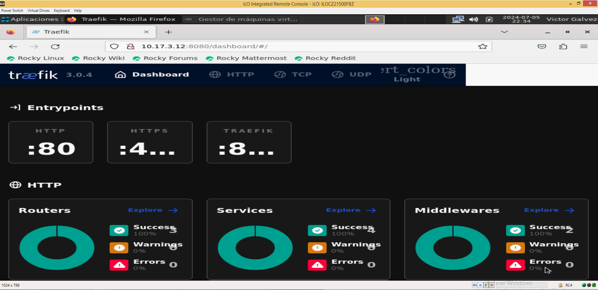

# Instalación de Traefik en LoadBalancer1 utilizando Docker Compose

A continuación se detallan los pasos para instalar Traefik en la máquina LoadBalancer1 con IP 10.17.3.12, dominio loadbalancer1.cefaslocalserver.com, y sistema operativo Rocky Linux 9.3.

## Paso 1: Preparar el Entorno

### 1.1 Acceder al Servidor

Conéctese al servidor loadbalancer1 mediante SSH:

```bash
sudo ssh -i /root/.ssh/cluster_openshift/key_cluster_openshift/id_rsa_key_cluster_openshift core@10.17.3.12 -p 22
```

### 1.2 Actualizar el Sistema

Actualice los paquetes del sistema:

```bash
sudo dnf update -y && sudo dnf upgrade -y
```

### 1.3 Instalar Dependencias

Instale las dependencias necesarias:

```bash
sudo dnf install -y epel-release
sudo dnf install -y wget vim
```

## Paso 2: Instalar Docker

### 2.1 Instalar Docker

Siga estos pasos para instalar Docker en Rocky Linux:

```bash
sudo dnf config-manager --add-repo=https://download.docker.com/linux/centos/docker-ce.repo
sudo dnf install -y docker-ce docker-ce-cli containerd.io
```

### 2.2 Iniciar y Habilitar Docker

Inicie el servicio de Docker y configúrelo para que se inicie automáticamente al arrancar el sistema:

```bash
sudo systemctl start docker
sudo systemctl enable docker
```

## Paso 3: Instalar Docker Compose

### 3.1 Descargar Docker Compose

Descargue Docker Compose usando curl:

```bash
sudo curl -L "https://github.com/docker/compose/releases/download/v2.20.2/docker-compose-$(uname -s)-$(uname -m)" -o /usr/local/bin/docker-compose
```

### 3.2 Dar Permisos de Ejecución

Asigne permisos de ejecución al binario descargado:

```bash
sudo chmod +x /usr/local/bin/docker-compose
```

### 3.3 Verificar la Instalación

Verifique que Docker Compose esté instalado correctamente:

```bash
/usr/local/bin/docker-compose --version
```

### 3.4 Añadir Docker Compose al PATH

Asegúrese de que Docker Compose esté en el PATH. Puede añadirlo temporalmente a su sesión actual:

```bash
export PATH=$PATH:/usr/local/bin
```

Para añadirlo permanentemente, puede añadir la línea anterior al archivo .bashrc o .bash_profile de su usuario:

```bash
echo 'export PATH=$PATH:/usr/local/bin' >> ~/.bashrc
source ~/.bashrc
```

### 3.5 Modificar el PATH para sudo

Edite el archivo /etc/sudoers para incluir /usr/local/bin en secure_path:

```bash
sudo visudo
```

Modifique la línea Defaults secure_path para que se vea así:

```bash
Defaults    secure_path = /sbin:/bin:/usr/sbin:/usr/bin:/usr/local/bin
```

## Paso 4: Configurar y Ejecutar Traefik con Docker Compose

### 4.1 Crear Directorio de Configuración de Traefik

Cree el directorio de configuración de Traefik:

```bash
sudo mkdir -p /etc/traefik
cd /etc/traefik
```

4.2 Crear el Archivo de Configuración traefik.toml

Cree el archivo traefik.toml con el siguiente contenido:

```bash
sudo vim /etc/traefik/traefik.toml
```

Contenido del archivo `traefik.toml`:

```toml
[entryPoints]
  [entryPoints.web]
    address = ":80"
  [entryPoints.websecure]
    address = ":443"
  [entryPoints.k8sApi]
    address = ":6443"

[api]
  dashboard = true
  insecure = true

[providers.docker]
  endpoint = "unix:///var/run/docker.sock"
  exposedByDefault = false

[log]
  level = "DEBUG"

[accessLog]

[certificatesResolvers.myresolver.acme]
  email = "your-email@example.com"
  storage = "acme.json"
  [certificatesResolvers.myresolver.acme.httpChallenge]
    entryPoint = "web"

[http.routers]
  [http.routers.api]
    entryPoints = ["websecure"]
    service = "api@internal"
    rule = "Host(`load_balancer1.cefaslocalserver.com`)"
  [http.routers.k8sApi]
    entryPoints = ["k8sApi"]
    service = "k8sApi"
    rule = "Host(`api.okd-cluster.cefaslocalserver.com`)"

[http.services]
  [http.services.api.loadBalancer]
    [[http.services.api.loadBalancer.servers]]
      url = "http://10.17.4.21:6443"
    [[http.services.api.loadBalancer.servers]]
      url = "http://10.17.4.22:6443"
    [[http.services.api.loadBalancer.servers]]
      url = "http://10.17.4.23:6443"
```

### 4.3 Crear el Archivo `acme.json`

Cree el archivo acme.json y ajuste los permisos:

```bash
sudo touch /etc/traefik/acme.json
sudo chmod 600 /etc/traefik/acme.json
```

### 4.4 Crear el Archivo docker-compose.yml

Cree el archivo docker-compose.yml con el siguiente contenido:

```bash
vim /etc/traefik/docker-compose.yml
```

Contenido del archivo `docker-compose.yml`:

```yaml
version: "3"

services:
  traefik:
    image: traefik:v3.1
    command:
      - --api.insecure=true
      - --providers.docker
      - --entrypoints.http.address=:80
      - --entrypoints.https.address=:443
      - --certificatesresolvers.myresolver.acme.email=your-email@example.com
      - --certificatesresolvers.myresolver.acme.storage=acme.json
      - --certificatesresolvers.myresolver.acme.httpchallenge.entrypoint=http
    ports:
      - "80:80"
      - "443:443"
      - "8080:8080"
    volumes:
      - /var/run/docker.sock:/var/run/docker.sock
      - /etc/traefik/traefik.toml:/traefik.toml
      - /etc/traefik/acme.json:/acme.json
    restart: always
```

### 4.5 Iniciar Traefik con Docker Compose

Navegue al directorio /etc/traefik y ejecute Docker Compose:

```bash
cd /etc/traefik
sudo /usr/local/bin/docker-compose up -d
```

## Paso 5: Verificar la Instalación

### 5.1 Verificar el Estado de Traefik

Puede verificar que el contenedor de Traefik esté en funcionamiento con:

```bash
sudo docker ps
```

### 5.2 Configurar el DNS


En el servidor dns freeipa1  Agregue un registro DNS para el dominio load_balancer1.cefaslocalserver.com apuntando a la IP del servidor LoadBalancer1 

```bash
curl http://10.17.3.12:8080/dashboard/
```


  ```bash
kinit admin
ipa dnsrecord-add cefaslocalserver.com load_balancer1 --a-rec 10.17.3.12
```

### 5.3 Acceder al Dashboard de Traefik

Abra un navegador web y acceda al dashboard de Traefik usando la IP pública o el dominio del servidor:

Verificación

Dashboard: Accede a http://load_balancer1.cefaslocalserver.com:8080/dashboard/ para verificar el estado del dashboard.
Logs: Revisa los logs para asegurarte de que no hay errores.


## Paso 6: Configurar el Firewall

### 6.1 Abrir Puertos en el Firewall

Abra los puertos necesarios en el firewall:

```bash
sudo firewall-cmd --permanent --add-port=80/tcp
sudo firewall-cmd --permanent --add-port=443/tcp
sudo firewall-cmd --permanent --add-port=8080/tcp
sudo firewall-cmd --reload
```

### 6.2 Abrir el Puerto 6443
```bash
sudo firewall-cmd --add-port=6443/tcp --permanent
sudo firewall-cmd --reload
```

```bash
sudo firewall-cmd --permanent --add-port=80/tcp
sudo firewall-cmd --permanent --add-port=443/tcp
sudo firewall-cmd --permanent --add-port=6443/tcp
sudo firewall-cmd --reload
```


Con estos pasos, habrás instalado y configurado Traefik en la máquina LoadBalancer1 utilizando Docker Compose.


## Traefik en Rocky Linux



__


